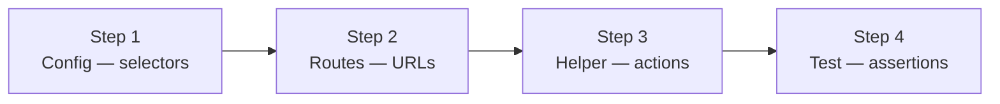

# Your First Test Module

> **Onboarding step 4 of 4** | Prev: [Discovery Process](discovery-process.md)

Walk-through of creating your first complete test module.

## The Three Layers (Quick Recap)

1. **Config** — Constants (selectors, routes)
2. **Helpers** — Async classes that interact with the app
3. **Tests** — Thin orchestration (call helpers, assert)

```
Config (what to find)
  ↓
Helpers (how to do it)
  ↓
Tests (what to verify)
```

## Example: Login Feature



Let's create a complete login test module.

### Step 1: Create Config (Selectors)

File: `playwright/configs/ui/modules/auth.ui.ts`

```typescript
export const AUTH_UI = {
  email: '[data-testid="login-email"]',
  password: '[data-testid="login-password"]',
  submitButton: 'button:has-text("Sign In")',
  errorMessage: '[role="alert"]',
  welcomeHeading: 'h1:has-text("Welcome")',
} as const;
```

**Rule:** Use constants, never hardcode selectors in tests.

### Step 2: Create Routes (URLs)

File: `playwright/configs/app/routes.ts` (add to existing)

```typescript
export const ROUTES = {
  login: "/login",
  dashboard: "/dashboard",
} as const;
```

### Step 3: Create Helper (Business Logic)

File: `playwright/support/helpers/modules/auth.helpers.ts`

```typescript
import { Page, expect } from "@playwright/test";
import { AUTH_UI } from "../../configs/ui/modules/auth.ui";
import { ROUTES } from "../../configs/app/routes";

export class AuthHelper {
  constructor(private page: Page) {}

  async login(email: string, password: string) {
    await this.page.fill(AUTH_UI.email, email);
    await this.page.fill(AUTH_UI.password, password);
    await this.page.click(AUTH_UI.submitButton);
  }

  async expectLoginSuccess() {
    await expect(this.page.locator(AUTH_UI.welcomeHeading)).toBeVisible();
  }

  async expectLoginError(message: string) {
    await expect(this.page.locator(AUTH_UI.errorMessage)).toContainText(message);
  }
}
```

### Step 4: Create Test (Orchestration)

File: `playwright/tests/auth/smoke/login-success.spec.ts`

```typescript
import { test, expect } from "../../fixtures/base.fixture";
import { AuthHelper } from "../../support/helpers/modules/auth.helpers";

test.describe("Authentication", () => {
  test("should login with valid credentials", async ({ page, baseURL }) => {
    const authHelper = new AuthHelper(page);

    // Navigate to login
    await page.goto(`${baseURL}/login`);

    // Perform login
    await authHelper.login("user@test.com", "password123");

    // Verify success
    await authHelper.expectLoginSuccess();
  });
});
```

## The Pattern in Action

| Layer      | File                    | Responsibility   | Example                                 |
| ---------- | ----------------------- | ---------------- | --------------------------------------- |
| **Config** | `auth.ui.ts`            | "WHAT to find"   | `email: '[data-testid="login-email"]'`  |
| **Helper** | `auth.helpers.ts`       | "HOW to do it"   | `login(email, password)`                |
| **Test**   | `login-success.spec.ts` | "WHAT to verify" | `await authHelper.expectLoginSuccess()` |

## Key Rules

✅ **DO:**

- Keep helpers focused on ONE feature
- Use constants for selectors
- Write helpers once, use in many tests
- Make test code readable at a glance

❌ **DON'T:**

- Hardcode selectors in tests
- Mix selector logic with test logic
- Create page objects (use helpers instead)
- Put business logic in tests

## Running Your Test

```bash
# Run just this test
npx playwright test playwright/tests/auth/smoke/login-success.spec.ts

# Run all auth tests
npx playwright test playwright/tests/auth/

# Run with browser visible
npm run test:headed

# Run with UI mode
npm run test:ui
```

## Next Steps

- Create more tests using the same pattern
- Add more helpers as you discover new flows
- Update selectors in config as the app evolves
- See [Writing Tests Guide](../../02-guides/writing-tests.md) for advanced patterns

## Common Pitfalls

### "I'm not sure which layer this goes in"

Ask:

- **Constants/Selectors?** → Config
- **How to interact?** → Helper
- **What to verify?** → Test

### "My helper is getting too big"

Split it:

```typescript
// Instead of one huge AuthHelper
export class AuthLoginHelper { ... }
export class Auth2FAHelper { ... }
export class AuthLogoutHelper { ... }
```

### "My test is still reading like code, not requirements"

Make it more readable:

```typescript
// ❌ Hard to read
await page.fill('[data-testid="email"]', "user@test.com");
await page.fill('[data-testid="password"]', "pass123");
await page.click('button:has-text("Sign In")');
await expect(page.locator("h1")).toContainText("Welcome");

// ✅ Clear and readable
const authHelper = new AuthHelper(page);
await authHelper.login("user@test.com", "pass123");
await authHelper.expectLoginSuccess();
```

Good luck! 🚀
