# Data-Driven Testing (DDT) Guide

Use DDT when a test needs to run with **multiple input datasets** to validate behavior across scenarios.

---

## When to Use DDT

### ✅ Good DDT Candidates

- **Login tests** with multiple user types (valid, invalid, locked, etc.)
- **Form validation** with edge cases (empty, invalid format, boundary values)
- **Checkout/Payment** with different user data (names, addresses, postal codes)
- **Search/Filter** with multiple query terms and expected results
- **Sorting** with different sort orders and expectations
- **Data ranges** (min/max dates, price filters, pagination)

### ❌ When NOT to Use DDT

- Tests that need different setup/teardown per scenario
- Tests with complex conditional logic
- Tests that check completely different features
- One-off tests without data variation

---

## Quick Start: Checkout Example

## DDT Intake Flow

The triage verdict decides everything downstream. The
[identify-ddt-candidates skill](../../.github/skills/identify-ddt-candidates/SKILL.md)
produces a `VERDICT`, which is passed straight into the scaffold script via `--verdict` —
so an agent and the script never disagree.

```mermaid
flowchart TD
    flow["Captured flow<br/>codegen / MCP / CLI"] --> triage{"identify-ddt-candidates<br/>skill: same steps,<br/>different data?"}
    triage -->|DDT_CANDIDATE| intake["Collect intake:<br/>goal, logic, variations,<br/>input + expected JSON"]
    triage -->|NOT_CANDIDATE| single["Single-scenario spec<br/>no fixtures generated"]
    intake --> scaffold["npm run scaffold:flow<br/>--verdict DDT_CANDIDATE"]
    scaffold --> data["testdata/&lt;m&gt;/&lt;f&gt;-data.json<br/>array of variations"]
    scaffold --> ctx["&#46;feature-context/&lt;m&gt;/&lt;f&gt;/<br/>retained intake summary"]
    data --> loop["for...of spec loop<br/>one case per dataset"]
```



For a flow discovered through codegen, MCP, or CLI capture, use this order:

1. Classify the flow with the DDT checklist.
2. If it repeats with different data, ask the user for:

- business goal
- simple business logic or controller conditions
- variation count
- input JSON for each variation
- expected JSON for each variation or a shared expected object
- any setup differences between scenarios

3. Write one JSON array to `playwright/testdata/<module>/<feature>-data.json`.
4. Generate one `for...of` spec loop.
5. Save the intake summary to `playwright/.feature-context/<module>/<feature>/`.

Recommended command:

```bash
npm run scaffold:flow -- --module mymodule --feature checkout --capture capture.json
```

Suggested context pack:

```json
{
  "module": "mymodule",
  "feature": "checkout",
  "businessGoal": "Validate checkout succeeds for eligible users",
  "businessLogic": "Only users over the threshold can apply the coupon",
  "controllerConditions": ["cart total > 50", "user is logged in"],
  "assertionIntent": "Success banner and order confirmation",
  "ddt": {
    "sharedAssertions": true,
    "variationCount": 2,
    "variations": [
      {
        "name": "valid user",
        "input": {
          "firstName": "John",
          "lastName": "Doe"
        },
        "expected": {
          "expectedConfirmationText": "Thank you for your order"
        }
      }
    ]
  }
}
```

### 1. Create JSON Test Data with Assertions

File: `playwright/testdata/mymodule/checkout-valid-users.json`

```json
[
  {
    "firstName": "John",
    "lastName": "Doe",
    "postalCode": "10001",
    "expectedConfirmationText": "Thank you for your order"
  },
  {
    "firstName": "Jane",
    "lastName": "Smith",
    "postalCode": "90210",
    "expectedConfirmationText": "Thank you for your order"
  }
]
```

**Key:** Include assertion values (like `expectedConfirmationText`) in the test data to avoid hardcoding in tests.

### 2. Parameterize with Explicit Iteration

File: `playwright/tests/mymodule/smoke/checkout-ddt.spec.ts`

```typescript
import { test } from "../../../fixtures/base.fixture";
import testData from "../../../testdata/mymodule/checkout-valid-users.json";

test.describe("Checkout — DDT", () => {
  for (const user of testData) {
    test(
      `checkout with user: ${user.firstName} ${user.lastName}`,
      { tag: ["@smoke"] },
      async ({ mymoduleHelpers }) => {
        await mymoduleHelpers.visitCheckout();
        await mymoduleHelpers.fillCheckoutInfo({
          firstName: user.firstName,
          lastName: user.lastName,
          postalCode: user.postalCode,
        });
        await mymoduleHelpers.finishOrder();
        await mymoduleHelpers.assertOrderConfirmed(
          user.expectedConfirmationText,
        );
      },
    );
  }
});
```

This runs **once per dataset** with each test title: `checkout with user: John Doe`, `checkout with user: Jane Smith`, etc.

---

## Architecture Rules for DDT

### ✅ DO

- Store test data in `playwright/testdata/<module>/*.json`
- Include assertion values in test data (avoid hardcoding)
- Keep helpers **data-agnostic** (they don't know about test data)
- Use `for...of` loops for parameterization
- Place tests in existing `smoke/` or `e2e/` folders
- Use template literals for descriptive test names: `` `test for ${data.item}` ``

### ❌ DON'T

- Hardcode test data in spec files
- Hardcode assertion values in spec files
- Create test data inside helpers
- Use different helpers per dataset
- Skip validation assertions
- Mix multiple features in one DDT test

---

## Identifying DDT in CLI Discovery

When using `playwright-cli` to discover a test, look for:

- **Repeated steps** with different input values
- **Similar assertions** for different scenarios
- **One core flow** with multiple data variations

Example flow:

```bash
playwright-cli open https://example.com
playwright-cli fill "firstName" "John"     # First dataset
playwright-cli fill "firstName" "Jane"     # Second dataset
playwright-cli fill "firstName" "Bob"      # Third dataset
```

→ **Good DDT candidate.** Capture all datasets and create JSON test data.

---

## Running Parameterized Tests

```bash
# Run all smoke tests (including parameterized)
npx playwright test --grep @smoke

# Run checkout tests only
npx playwright test --grep "@checkout"

# Run specific test data scenario
npx playwright test -g "completes checkout for John Doe"

# Run with verbose output to see each parameterized run
npx playwright test --verbose --grep @checkout
```

---

## File Organization

```
playwright/
├── testdata/
│   └── mymodule/
│       ├── checkout-valid-users.json
│       └── checkout-invalid-users.json
└── tests/
    └── mymodule/
        └── smoke/
            ├── checkout-ddt.spec.ts  ← Parameterized tests
            └── smoke.spec.ts
```
