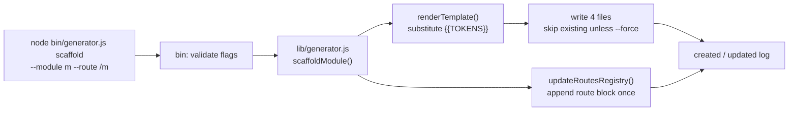

# Generator CLI

Use the generator to scaffold a new module in Config → Helpers → Tests order.

> This is the **static module scaffolder**. For the interactive data-driven scaffolder,
> see [Data-Driven Testing](../02-guides/data-driven-testing.md). For how both generators
> are built internally, see [Project Internals](./project-internals.md).

## How scaffolding works



## Command

```bash
node bin/generator.js scaffold --module <module> --route <route>
```

Optional flags:

- `--root <path>`: generate into a different workspace root
- `--force`: overwrite existing generated files

## Example

```bash
node bin/generator.js scaffold --module account --route /account
```

## What it creates

- `playwright/configs/ui/modules/<module>/<module>.ui.ts`
- `playwright/support/helpers/modules/<module>.helpers.ts`
- `playwright/tests/<module>/smoke/<module>-smoke.spec.ts`
- `playwright/testdata/<module>/<module>.json`
- A new route block appended to `playwright/configs/app/routes.ts`

## Environment files

If the generated tests need secrets or app configuration, copy `.env.example` to `.env` and update values before running Playwright.
