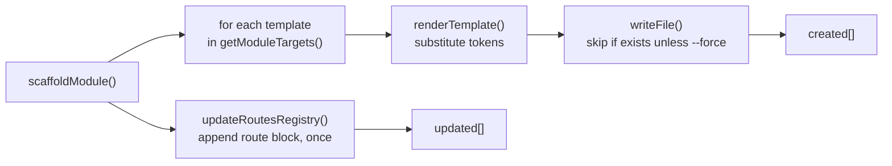
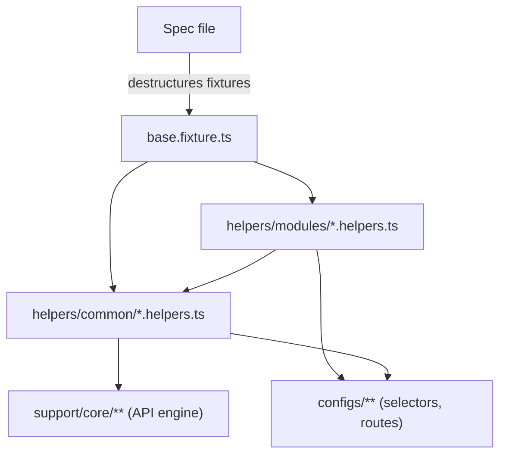

# Project Internals

What every non-test folder in this repo does, and how the pieces connect. Read this
when you need to understand _how the framework generates and runs tests_ rather than
how to write one.

There are **two separate generators** in this repo. Knowing which is which prevents
most confusion:

| Generator             | Entry command                    | Interactive?         | Produces                                            |
| --------------------- | -------------------------------- | -------------------- | --------------------------------------------------- |
| **Module scaffolder** | `node bin/generator.js scaffold` | No                   | Empty Config → Helpers → Test skeleton from a route |
| **DDT scaffolder**    | `npm run scaffold:flow`          | Yes (or `--verdict`) | Data-driven testdata + spec + retained context pack |

---

## Directory Map

```mermaid
flowchart TD
    subgraph gen["Static module scaffolder"]
        bin["bin/generator.js<br/>CLI entry + arg validation"]
        lib["lib/generator.js<br/>render engine + file writer"]
        tpl["templates/module/*.tpl<br/>token source files"]
    end

    subgraph ddt["DDT / agentic scaffolder"]
        runner["scripts/scaffold-runner.js<br/>thin wrapper"]
        ddtgen["scripts/generate-ddt-scaffold.js<br/>intake wizard + writer"]
        capture["scripts/capture/post-capture.js<br/>post-capture hook"]
        check["scripts/check-ddt-fixtures.js<br/>fixture validator"]
    end

    subgraph rt["Runtime support (imported by tests)"]
        core["support/core/**<br/>low-level API engine"]
        helpers["support/helpers/**<br/>test-facing helpers"]
    end

    boot["scripts/bootstrap.js<br/>one-time environment setup"]

    bin --> lib --> tpl
    capture --> runner --> ddtgen
    ddtgen -.->|writes JSON validated by| check
    helpers --> core
```



---

## `bin/generator.js` — Module scaffolder CLI

The thin command-line front door for the **static** module scaffolder.

- Parses `process.argv`, then dispatches on the first positional (`scaffold` or `help`).
- Requires `--module <name>` and `--route <path>`; errors and prints help if either is missing.
- Delegates all real work to `scaffoldModule()` in `lib/generator.js`.
- Prints one `created …` / `updated …` line per file touched.

It contains **no file-writing or templating logic** — only argument handling and output.
Keep it that way; the engine belongs in `lib/`.

```bash
node bin/generator.js scaffold --module account --route /account
```

---

## `lib/generator.js` — Module scaffolder engine

The actual scaffolding engine. Pure Node, no dependencies, unit-tested by
[tests/generator.test.js](../../tests/generator.test.js).

| Function                         | Responsibility                                                       |
| -------------------------------- | -------------------------------------------------------------------- |
| `parseArgs(argv)`                | Turn `--flag value` pairs into an object (positional args go in `_`) |
| `renderTemplate(tpl, tokens)`    | Replace `{{TOKEN}}` placeholders with values                         |
| `toUpperModuleName(name)`        | Normalize a module name into a `SCREAMING_SNAKE` key                 |
| `getModuleTargets(root, module)` | Map each `.tpl` to its destination path                              |
| `updateRoutesRegistry(...)`      | Insert a new route block into `configs/app/routes.ts` (idempotent)   |
| `scaffoldModule(opts)`           | Orchestrate the above: render templates → write files → patch routes |



**Idempotency:** existing files are skipped unless `--force` is passed, and a route
block is only inserted if the module key is not already present. Re-running is safe.

---

## `templates/module/` — Token source files

The `.tpl` files `lib/generator.js` renders. Each uses `{{MODULE}}`, `{{MODULE_UPPER}}`,
and `{{ROUTE}}` placeholders.

| Template            | Rendered into                             | Purpose                           |
| ------------------- | ----------------------------------------- | --------------------------------- |
| `ui.ts.tpl`         | `configs/ui/modules/<m>/<m>.ui.ts`        | Selector constants (`as const`)   |
| `helpers.ts.tpl`    | `support/helpers/modules/<m>.helpers.ts`  | Module helper class               |
| `smoke.spec.tpl`    | `tests/<m>/smoke/<m>-smoke.spec.ts`       | Fixture-first smoke spec skeleton |
| `testdata.json.tpl` | `testdata/<m>/<m>.json`                   | Empty data fixture array          |
| `routes.block.tpl`  | _(appended into)_ `configs/app/routes.ts` | Route constant block              |

> `smoke.spec.tpl` imports `test` from `@fixtures/base.fixture` and destructures helpers
> — it never instantiates a helper class directly, so generated code is rule-compliant
> from the first run.

---

## `scripts/` — Operational tooling

Node scripts wired to `npm run` commands in [package.json](../../package.json). None of
these are imported by tests; they exist to set up the environment and generate DDT assets.

### `scripts/bootstrap.js` — One-time environment setup

Run via `npm run bootstrap`. Prepares a fresh clone to run:

1. `npm install`
2. `npx playwright install`
3. Copies `playwright/environments/.env.qa.example` → `.env` (if missing)
4. Ensures `.vscode/mcp.json` exists
5. Writes a run record to `playwright/evidence/bootstrap/latest.json`

### `scripts/generate-ddt-scaffold.js` — DDT intake wizard

Run via `npm run scaffold:flow`. The interactive **data-driven** scaffolder.

- Reads an optional `--capture <file>` and classifies it with `analyzeCapture()`.
- Accepts a `--verdict DDT_CANDIDATE|NOT_CANDIDATE` override so an agent can supply the
  verdict from the [identify-ddt-candidates skill](../../.github/skills/identify-ddt-candidates/SKILL.md)
  instead of relying on capture heuristics.
- Collects intake answers (business goal, assertions, datasets) unless a `--context` /
  `--intake` JSON file is provided.
- Writes three artifacts: the testdata array, a retained context pack, and a summary,
  under `playwright/testdata/<m>/` and `playwright/.feature-context/<m>/<f>/`.

### `scripts/scaffold-runner.js` — Wrapper

A thin wrapper that spawns `generate-ddt-scaffold.js` with normalized flags. Used by the
post-capture hook so the capture pipeline and manual runs share one code path.

### `scripts/capture/post-capture.js` — Post-capture hook

Run via `npm run capture:post`. Locates a capture artifact (from `--capture` or a default
`.feature-context` path, falling back to `capture.json`) and hands it to `scaffold-runner.js`.

### `scripts/check-ddt-fixtures.js` — Fixture validator

Run via `npm run check:ddt-fixtures`. Walks `playwright/testdata/**`, and for each JSON file
asserts it is an **array** of objects, each carrying assertion keys (`expected*` / `should*`).
Fails the run with a clear message if a fixture drifts from the DDT contract.

```mermaid
flowchart LR
    codegen["Codegen / MCP capture"] --> capfile["capture.json"]
    capfile --> post["post-capture.js"]
    post --> runner["scaffold-runner.js"]
    runner --> gen["generate-ddt-scaffold.js"]
    gen --> data["testdata/&lt;m&gt;/*.json"]
    gen --> ctx["&#46;feature-context/&lt;m&gt;/&lt;f&gt;/"]
    data --> validate["check-ddt-fixtures.js"]
```



---

## `playwright/support/` — Runtime support code

The only non-test code that tests actually import. Split into two tiers:

### `support/core/**` — Low-level engine

Framework plumbing, **not** used directly in specs.

- `core/api/api.engine.ts` — `registerRoute`, `registerAllRoutes`, `waitForAPI` built on
  `page.route()` and `page.waitForResponse()`.
- `core/api/api-config.factory.ts` — `createModuleConfig()` generates CRUD API entries from
  a compact module definition.
- `core/api/status-codes.ts` — the `HTTP_STATUS` single source of truth.

### `support/helpers/**` — Test-facing helpers

The layer specs use through fixtures (`{ api, nav, ui, har }`).

- `helpers/common/*.helpers.ts` — shared `ApiHelpers`, `NavigationHelpers`, `UiHelpers`,
  `HarHelpers`.
- `helpers/modules/*.helpers.ts` — one class per feature module, owning its actions.



---

## See Also

- [Generator CLI](./generator-cli.md) — command reference for the module scaffolder
- [Three-Layer Pattern](../04-architecture/three-layer-pattern.md) — why Config → Helpers → Tests
- [Data-Driven Testing](../02-guides/data-driven-testing.md) — the DDT authoring workflow
