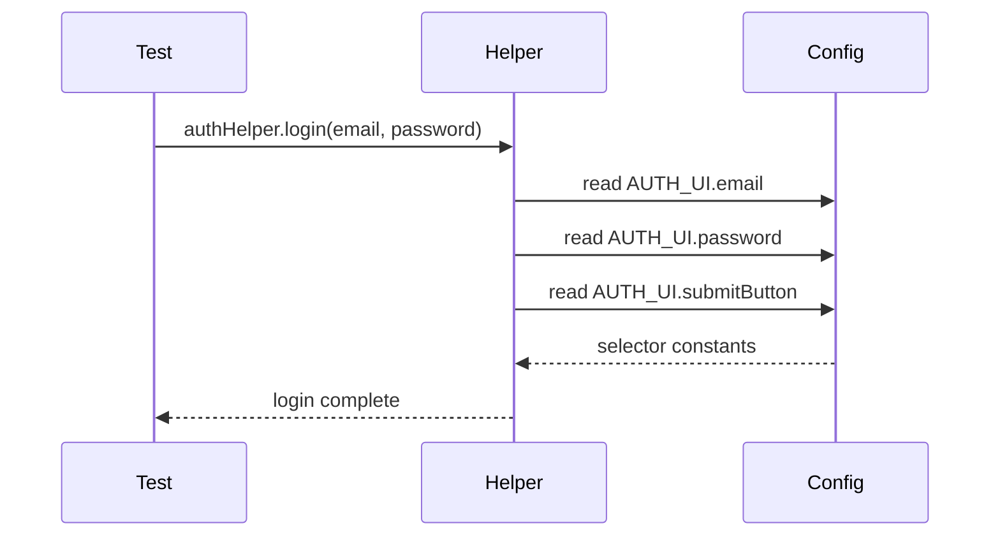

# Three-Layer Architecture

Why this framework is structured as Config → Helpers → Tests.

## The Three Layers

```
┌──────────────────────────────────────────┐
│            TESTS                         │  ← What to verify
│      (Thin orchestration)                │
└──────────────────┬───────────────────────┘
                   │
┌──────────────────▼───────────────────────┐
│            HELPERS                       │  ← How to do it
│   (Async classes, business logic)        │
└──────────────────┬───────────────────────┘
                   │
┌──────────────────▼───────────────────────┐
│            CONFIG                        │  ← What to find
│  (Constants: selectors, routes, data)    │
└──────────────────────────────────────────┘
```

## Why This Order?

### Config (Bottom): Pure Data

**Selectors are constants, not logic.**

```typescript
// Config ONLY
export const AUTH_UI = {
  email: '[data-testid="login-email"]',
  password: '[data-testid="login-password"]',
  submitButton: 'button:has-text("Sign In")',
} as const;
```

**Benefits:**

- Single source of truth for selectors
- Easy to update when UI changes (one place)
- Zero logic — just data

### Helpers (Middle): How

**Encapsulate "how to do things."**

```typescript
// Helper: knows HOW to login
export class AuthHelper {
  async login(email: string, password: string) {
    await this.page.fill(AUTH_UI.email, email);
    await this.page.fill(AUTH_UI.password, password);
    await this.page.click(AUTH_UI.submitButton);
  }
}
```

**Benefits:**

- Business logic isolated from test code
- Reusable across many tests
- Easy to refactor (change once, all tests benefit)
- Clear responsibility

### Tests (Top): What

**Tests only describe WHAT to verify.**

```typescript
// Test: orchestrates helpers, makes assertions
test("should login successfully", async ({ page }) => {
  const authHelper = new AuthHelper(page);

  await authHelper.login("user@test.com", "password123");
  await expect(page).toHaveURL("**/dashboard");
});
```

**Benefits:**

- Readable at a glance (what is being tested?)
- Minimal setup/teardown
- Focuses on behavior, not mechanics
- Easy to maintain

## The Flow



**When you write a test:**

```typescript
// 1. Test orchestrates
await authHelper.login('user@test.com', 'password123');

// 2. Helper uses Config
async login(email, password) {
  await this.page.fill(AUTH_UI.email, email);  // ← from Config
}

// 3. Config provides selectors
export const AUTH_UI = {
  email: '[data-testid="login-email"]',  // ← pure data
}
```

**When the UI changes:**

If the selector for email changes from `data-testid="login-email"` to `data-testid="email-input"`:

1. Update only in Config (`auth.ui.ts`)
2. Helper automatically uses the new selector
3. All 50 tests that use this helper work instantly
4. No test code changes needed

## Why NOT Page Objects?

This framework uses **Helpers, not Page Objects.**

```typescript
// ❌ Page Object Pattern
export class LoginPage {
  fillEmail() { ... }
  fillPassword() { ... }
  clickSubmit() { ... }
}

// ✅ Helper Pattern (this framework)
export class AuthHelper {
  async login(email, password) {  // Business action
    await this.page.fill(AUTH_UI.email, email);
    await this.page.fill(AUTH_UI.password, password);
    await this.page.click(AUTH_UI.submitButton);
  }
}
```

**Why Helpers are better:**

- Encapsulate complete business actions (not just UI interactions)
- Easier to reuse
- Clearer intent
- Matches how testers think about workflows

## Putting It Together

### Config

```typescript
// WHERE to find things
export const AUTH_UI = {
  email: '[data-testid="login-email"]',
  password: '[data-testid="login-password"]',
  submitButton: 'button:has-text("Sign In")',
} as const;

export const ROUTES = {
  login: "/login",
  dashboard: "/dashboard",
} as const;
```

### Helpers

```typescript
// HOW to do things
export class AuthHelper {
  async login(email: string, password: string) {
    await this.page.goto(ROUTES.login);
    await this.page.fill(AUTH_UI.email, email);
    await this.page.fill(AUTH_UI.password, password);
    await this.page.click(AUTH_UI.submitButton);
  }
}
```

### Tests

```typescript
// WHAT to verify
test("should login successfully", async ({ page }) => {
  const authHelper = new AuthHelper(page);
  await authHelper.login("user@test.com", "password123");
  await expect(page).toHaveURL("**/dashboard");
});
```

## Principles

1. **Separation of Concerns** — Each layer has one job
2. **DRY (Don't Repeat Yourself)** — Write once, use everywhere
3. **Maintainability** — Change the UI? Update one place
4. **Readability** — Tests read like requirements
5. **Reusability** — Helpers work across projects

## Related

See [Module Anatomy](./module-anatomy.md) for the full file structure of a complete module.
