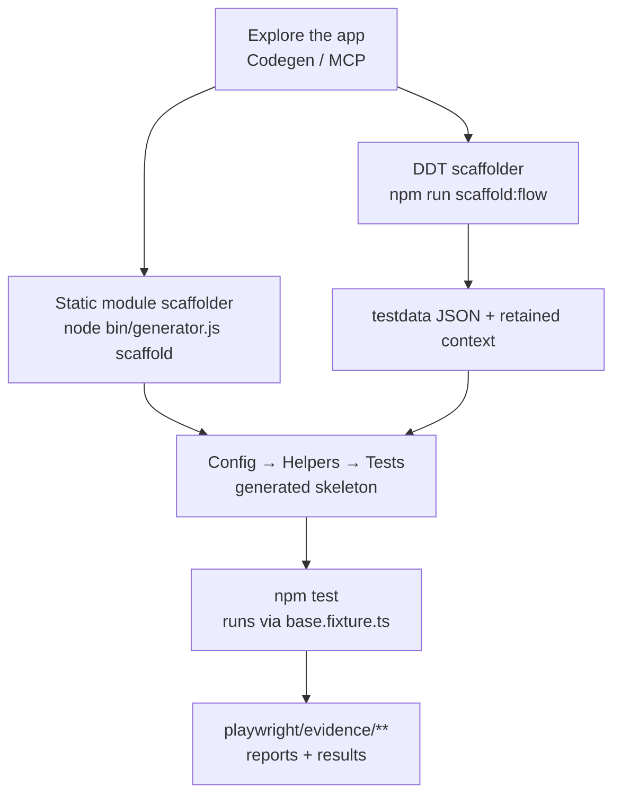

# Playwright Boilerplate Apetizer — Documentation

Complete guide to CLI/MCP test generation and DDT evaluation with this stripped-down framework.

---

## Docs Journey

| Step   | Focus                    | Start Here                                                                          |
| ------ | ------------------------ | ----------------------------------------------------------------------------------- |
| 1 of 4 | Setup & Environment      | [Getting Started](./01-getting-started/README.md)                                   |
| 2 of 4 | Run & Record             | [Guides](./02-guides/README.md)                                                     |
| 3 of 4 | Add to the Framework     | [Guides](./02-guides/README.md)                                                     |
| 4 of 4 | Reference & Architecture | [Reference](./03-reference/README.md) · [Architecture](./04-architecture/README.md) |

---

## How It Fits Together

Two generation paths feed the same three-layer runtime. Explore the app, scaffold either a
plain module skeleton or a data-driven flow, then run tests through fixtures.



> New to the internals? See **[Project Internals](./03-reference/project-internals.md)** for
> what every script, generator, and support file actually does.

---

## 🤖 For Coding Agents (Claude Code, GitHub Copilot, etc.)

**Get started in 2 minutes:**

```bash
npm install -g @playwright/cli@latest
playwright-cli open https://example.com
playwright-cli snapshot
playwright-cli click e15
```

**Your resources:**

- **Browser automation:** [playwright-cli Complete Guide](./03-reference/playwright-cli-agents.md) — 100+ commands, workflows, best practices
- **Repo custom agent:** `.github/agents/playwright-cli.md` — token-efficient CLI-first Playwright routing
- **Test generation:** [Recording Tests](./02-guides/recording-tests.md) — Codegen workflow
- **Selectors:** [Selector Strategies](./02-guides/selector-strategies.md) — prefer getByRole, data-testid as fallback
- **Architecture:** [Three-Layer Pattern](./04-architecture/three-layer-pattern.md) — Config → Helpers → Tests
- **DDT:** [Data-Driven Testing](./02-guides/data-driven-testing.md) — parameterized tests with JSON data

---

## 🚀 New to This Project? (Humans)

Start here → **[Setup & Environment](./01-getting-started/README.md)**

- [Discovery Process](./01-getting-started/discovery-process.md)
- [Run & Add Guide](./02-guides/README.md)
- [Reference](./03-reference/README.md)
- [Architecture](./04-architecture/README.md)

---

## 📚 Documentation By Use Case

### I want to...

#### Generate Tests from Codegen

👉 [Recording Tests](./02-guides/recording-tests.md) — Playwright Codegen workflow

#### Write Tests Using Helpers

👉 [Writing Tests Guide](./02-guides/writing-tests.md) — three-layer pattern

#### Find the Right Selector

👉 [Selector Strategies](./02-guides/selector-strategies.md) — getByRole first, data-testid as fallback

#### Data-Drive My Tests

👉 [Data-Driven Testing](./02-guides/data-driven-testing.md) — parameterized tests with JSON fixtures

#### Understand the Architecture

👉 [Three-Layer Pattern](./04-architecture/three-layer-pattern.md) — why Config → Helpers → Tests?  
👉 [Module Anatomy](./04-architecture/module-anatomy.md) — structure of a complete module  
👉 [Patterns & Anti-Patterns](./04-architecture/patterns-and-anti-patterns.md) — do's and don'ts

---

## 🔗 Key Files

| What                 | Where                                                                                                 |
| -------------------- | ----------------------------------------------------------------------------------------------------- |
| Framework rules      | [.github/FRAMEWORK_RULES.md](../.github/FRAMEWORK_RULES.md)                                           |
| Copilot instructions | [.github/copilot-instructions.md](../.github/copilot-instructions.md)                                 |
| CLI agent            | [.github/agents/playwright-cli.md](../.github/agents/playwright-cli.md)                               |
| CLI workflow skill   | [.github/skills/playwright-cli-workflow/SKILL.md](../.github/skills/playwright-cli-workflow/SKILL.md) |
| DDT identification   | [.github/skills/identify-ddt-candidates/SKILL.md](../.github/skills/identify-ddt-candidates/SKILL.md) |
