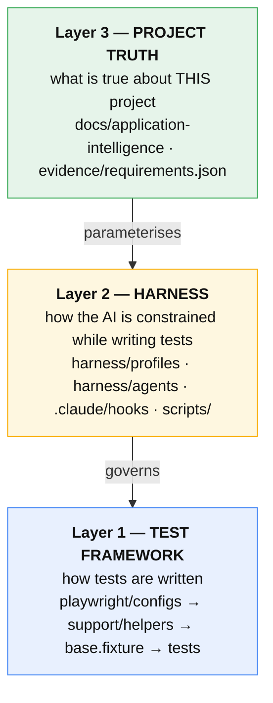
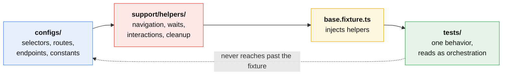
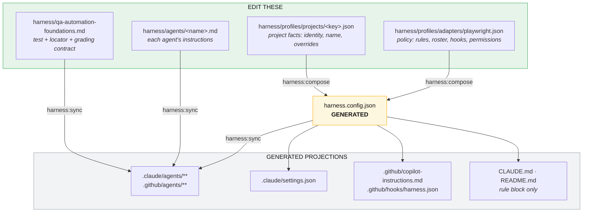
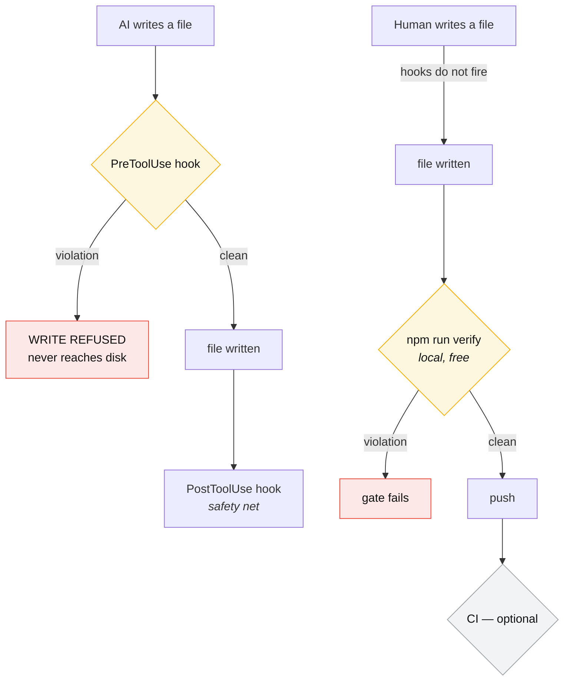
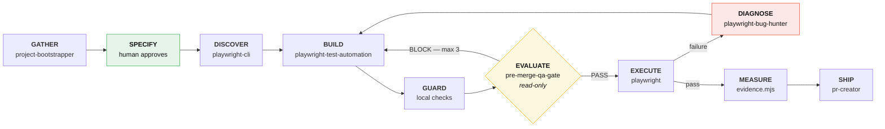
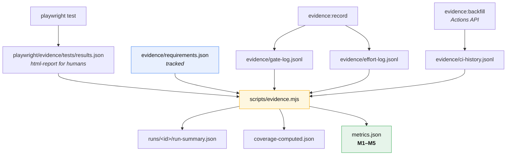

# Start Here — The Complete Playwright Harness Guide

This repository is an **empty, application-agnostic QA harness**. It contains no application, no
requirements, no selectors, no credentials, and no tests. You point it at a project; it gathers
verified context, builds requirement-backed tests, grades them with an independent gate, executes
them, and emits evidence and metrics.

This is the only document you need. It is self-contained.

|                  |                                 |
| ---------------- | ------------------------------- |
| **Adapter**      | Playwright                      |
| **Architecture** | Config → Helpers → Tests        |
| **Spec glob**    | `playwright/tests/**/*.spec.ts` |
| **Language**     | TypeScript                      |
| **Rules**        | 12 — 8 blocking, 4 graded       |
| **Agent roles**  | 7                               |

---

## 1. Architecture — three layers

The harness is not a test framework. It governs one.



Layer 1 is framework-native on purpose. Layer 2 is the same design in the Cypress adapter. Layer 3 is
the only thing a new project authors.

### 1.1 The dependency rule



A spec that imports `test` from `@playwright/test` has bypassed the injection point, and
`base-fixture-import` refuses the write. A spec that reaches straight for a selector trips
`no-hardcoded-selector`.

---

## 2. Installation

### 2.1 Prerequisites

- Node.js 20+ and npm
- Git
- **No paid service is required.** Any reporting or device-cloud service is an optional enhancement,
  never a baseline dependency.

### 2.2 Install

```bash
npm ci
```

```bash
npx playwright install --with-deps chromium
```

### 2.3 Verify the empty harness

This is the acceptance test for a correct installation.

```bash
npm run verify
```

That chain is `harness:check` → `harness:test` → `harness:format:check` → `check:rules` →
`tsc --noEmit` → `npm test` (with `lint` via `pretest`) → `evidence:build`. Run them individually to
isolate a failure.

Expected:

```text
Running 0 tests using 0 workers
[evidence] bootstrap: 0 passed, 0 failed, 0 traceability gap(s)
```

**Zero tests passing is the correct result** — Playwright's native `--pass-with-no-tests` makes the
empty state valid. The harness ships empty by design. If this fails, the installation is broken — do
not start intake.

### 2.4 Starting a brand-new project from zero

Do not hand-write `harness.config.json`; it is generated. Write an ~8-line profile and compose it:

```bash
cp harness/profiles/projects/_template.json harness/profiles/projects/<key>.json
```

```bash
npm run harness:compose && npm run harness:sync && npm run harness:check
```

You now have the full seven-role roster, every rule enforced at write time, and both AI adapters
wired — with no tests. See [`harness/profiles/README.md`](../harness/profiles/README.md).

### 2.5 Environment and secrets

Never commit a credential. `no-credential-literal` blocks literals at write time.

| Where                                     | What                         |
| ----------------------------------------- | ---------------------------- |
| `.env` (**gitignored**)                   | local secrets                |
| `process.env.KEY`                         | how a test reads them        |
| `playwright/environments/.env.qa.example` | **non-secret settings only** |
| CI secret store                           | secrets in the pipeline      |

```bash
cp .env.example .env
```

Authentication uses a `storageState` setup project, not a login in `beforeEach()` —
`storage-state-auth` enforces that.

---

## 3. Configuration — four hand-edited files, two generation stages



After any policy change:

```bash
npm run harness:compose && npm run harness:sync && npm run harness:check
```

Two independent drift checks, both inside `npm run verify`:

| Check                                        | Catches                                            |
| -------------------------------------------- | -------------------------------------------------- |
| `harness:profile:verify` (in `harness:test`) | `harness.config.json` edited away from its profile |
| `harness:check`                              | any projection edited away from the config         |

Generated files are **not** prettier-formatted, deliberately: prettier realigns the generated rule
table and collapses arrays that `JSON.stringify` expands, so formatting an artifact makes its
generator report drift. `.prettierignore` shields them; the format gate checks the sources.

### 3.1 What the config owns

| Key                    | Owns                                                   |
| ---------------------- | ------------------------------------------------------ |
| `framework`, `project` | adapter, paths, architecture, spec glob                |
| `adapters`             | which AI tools get projections                         |
| `context`, `loops`     | model effort; `gateRepairLimit`                        |
| `rules[]`              | `id`, `severity`, `never`, `instead`, `why`, `message` |
| `agents[]`             | `name`, `role`, `model`, `tools`, `when`               |
| `hooks`                | which hook script runs on which event                  |
| `permissions`          | `defaultMode: plan`, allow/deny lists                  |

**To add a rule:** append to `rules[]` in the adapter baseline, compose, sync. It appears in
`CLAUDE.md`, `README.md`, and `copilot-instructions.md` automatically. For write-time blocking, add
its pattern to `.claude/hooks/shared-rules.mjs` — engine code, not a projection.

---

## 4. Enforcement — what actually stops a violation

**CI is a backstop, not the enforcement point.** The harness never requires a paid service. That
matters more here because this repo is private, so its runner minutes are metered rather than free.



| Enforcement                        | Runs                    | Cost                                     | Blocks?                     |
| ---------------------------------- | ----------------------- | ---------------------------------------- | --------------------------- |
| `PreToolUse` / `PostToolUse` hooks | locally, in Claude Code | free                                     | **yes — refuses the write** |
| `npm run verify`                   | locally                 | free                                     | yes, on demand              |
| CI                                 | hosted runners          | free on public repos; metered on private | backstop only               |

Hooks fire only in Claude Code sessions, so CI exists to catch **human-authored** code. Without CI,
run the same gates before every push — no dependency, just core git:

```bash
git config core.hooksPath .githooks
```

`SKIP_VERIFY=1 git push` bypasses it deliberately.

Every rule is enforced identically in `.ts`, `.mts`, `.cts`, `.js`, `.mjs`, and `.cjs`.
`scripts/harness/test-rule-extensions.mjs` asserts the same violating spec yields the **same count**
in all six. That test exists because it was once false: patterns matched only `.ts`, and
`playwright.config.ts` sets no `testMatch`, so Playwright's default pattern would execute a
`.spec.js` while every rule silently passed on it.

TypeScript is the intended language here — the `.js` coverage is a safety net, not an invitation.

### 4.1 The rules

| Rule                    | Severity | Why it exists                                                              |
| ----------------------- | -------- | -------------------------------------------------------------------------- |
| `no-hard-wait`          | block    | A fixed delay hides the real readiness condition and flakes in CI.         |
| `no-hardcoded-selector` | block    | A UI change should have one owner, not scattered copies.                   |
| `no-hardcoded-route`    | block    | Routes and API contracts need one maintained registry.                     |
| `no-page-object`        | block    | A second UI abstraction duplicates config and helper ownership.            |
| `no-credential-literal` | block    | A committed credential is a breach, not a style issue.                     |
| `storage-state-auth`    | block    | Authentication should be isolated and cached, not repeated in every test.  |
| `base-fixture-import`   | block    | The fixture is the single injection point for helpers.                     |
| `smoke-read-only`       | block    | Smoke coverage must be safe against shared and production-like envs.       |
| `locator-priority`      | graded   | Semantic locators are more stable and accessible.                          |
| `narrow-before-index`   | graded   | Index locators silently target the wrong element when the UI changes.      |
| `search-before-create`  | graded   | Duplicate owners cause the same app change to need multiple fixes.         |
| `one-requirement-tag`   | graded   | The title survives every reporter; together they make coverage computable. |

Legitimate exceptions go in `.claude/hooks/playwright-hook-allowlist.json` with a justification —
never by weakening a rule.

Four rules are graded rather than blocked because deciding them needs real analysis, not a regex, and
a regex here produces false positives that teach people to ignore the hook. `locator-priority` and
`narrow-before-index` are defined in the **Locator contract** section of
`harness/qa-automation-foundations.md`, which is injected into the BUILD and EVALUATE agents, and the
gate scores them with a −10 deduction each. `npm run check:locator-strategy` covers a narrower,
adjacent check: action locators with no `.or()` fallback.

---

## 5. The lifecycle



The `EVALUATE → BUILD` repair loop is bounded by `loops.gateRepairLimit` (3). After three failed
repairs it stops and escalates to a human. An unbounded repair loop is how an agent burns a budget
converging on nothing.

### 5.1 The roster

| Role     | Agent                        | Model  | Why it is separate                                        |
| -------- | ---------------------------- | ------ | --------------------------------------------------------- |
| GATHER   | `project-bootstrapper`       | sonnet | Verified context before any test exists                   |
| DISCOVER | `playwright-cli`             | sonnet | Codegen and browser discovery; never decides intent       |
| BUILD    | `playwright-test-automation` | sonnet | Owns authoring for exactly one requirement                |
| DIAGNOSE | `playwright-bug-hunter`      | opus   | Root cause + compliant fix; hardest reasoning             |
| EVALUATE | `pre-merge-qa-gate`          | opus   | **Read-only. A builder must never grade its own output.** |
| SHIP     | `pr-creator`                 | sonnet | PR with the standard generated description                |
| MAINTAIN | `workflow-maintainer`        | sonnet | Simplify without duplicating ownership                    |

`pre-merge-qa-gate` has `permissionMode: plan` and `tools: [Read, Grep, Glob]` — no Write, no Bash.
That restriction is the entire reason the gate is trustworthy, and it is **declared in config**, not
requested in a prompt. `harness:profile:test` asserts it.

### 5.2 Source precedence

When two sources disagree, the agent stops and reports the conflict. It does not guess.

1. `harness.config.json` — roles, tools, limits, rules
2. `harness/qa-automation-foundations.md` — test, locator, and grading contract
3. `evidence/requirements.json` — approved requirements
4. `docs/application-intelligence/**` — verified project behavior
5. `playwright/configs/**` — selectors, routes, APIs, evidence paths
6. `playwright/support/helpers/**` — reusable implementation
7. `playwright/fixtures/base.fixture.ts` — helper injection
8. `playwright/tests/**` — thin orchestration

---

## 6. Step by step

### Step 0 — Verify the empty state

Section 2.3. Do not skip it.

### Step 1 — GATHER verified project context

Invoke `project-bootstrapper`:

```text
Start project intake for <project>.
Application source: <repository path or URL>
Requirement source: <tracker/specification/owner>
Known environments: <dev/qa/staging/prod>
Do not generate tests. Record unknowns and stop for approval where safety or expected behavior is unclear.
```

It writes `docs/application-intelligence/project-context.md` and
`docs/application-intelligence/<module>/module-context.md` from the templates in `_template/`.

**The hard rule:** the agent may not invent an application, requirement, selector, route, credential,
or expected result. Every claim is source-linked; an unavailable fact is recorded as unknown, not
filled in.

Never put credentials, PII, payment data, or production records in these files.

Do not proceed until the owner approves environment mutation rules, authentication, selector strategy,
synthetic data creation and cleanup, and at least one module contract.

### Step 2 — SPECIFY and approve requirements

The agent drafts; **a human promotes to `active`**. Nothing is built from a draft.

```json
{
  "version": 1,
  "requirements": [
    {
      "id": "PAY-CHECKOUT-001",
      "status": "active",
      "module": "checkout",
      "title": "Registered user completes checkout with a saved card",
      "expectedOutcome": "Order confirmation shows the order number",
      "source": "docs/application-intelligence/checkout/module-context.md#happy-path",
      "acceptanceCriteria": ["Confirmation number is displayed"],
      "preconditions": ["A registered user with one saved card"],
      "type": "SMOKE",
      "priority": "P0",
      "tier": "smoke"
    }
  ]
}
```

`evidence:build` throws if an active requirement is missing any field, has an empty
`acceptanceCriteria` or `preconditions`, or uses a value outside `SMOKE|REGRESSION` / `P0|P1|P2` /
`smoke|e2e|ddt`. Ids must be unique. Automate P0 first; keep unclear items in `draft`.

### Step 3 — DISCOVER, only if selectors are unknown

Invoke `playwright-cli`. It uses codegen and CLI inspection:

```bash
npx playwright codegen <url>
```

Output is **config constants only**; writing a helper or spec here bypasses the BUILD role. Follow the
Locator contract: semantic locators before test ids, test ids before CSS.

### Step 4 — BUILD one requirement

Invoke `playwright-test-automation` with **exactly one active requirement id**:

```text
Build requirement PAY-CHECKOUT-001. Use the approved application context and run the focused test.
```

It produces, in order:

```text
playwright/configs/ui/modules/<module>/   selectors
playwright/configs/app/routes.ts          routes
playwright/configs/api/modules/<module>/  endpoints, if the requirement needs API
playwright/support/helpers/               reusable interaction
playwright/tests/<module>/<tier>/         the spec — thin orchestration
```

Every title begins `[REQUIREMENT-ID]` and carries matching requirement, Type, Priority, and tier tags.
The title prefix is what makes coverage computable across every reporter.

Specs import `test` and `expect` from `playwright/fixtures/base.fixture.ts`, never from
`@playwright/test`.

The `block` hooks fire on every write. A hardcoded selector or a `page.waitForTimeout(500)` is refused
as it is written, not caught in review.

### Step 5 — GUARD locally

```bash
npm run check:rules && npm run lint && npx tsc --noEmit && npm run check:locator-strategy
```

### Step 6 — EVALUATE with the independent gate

Supply `pre-merge-qa-gate` with the diff and the exact command output from Step 5, plus:

```bash
npx playwright test --grep @PAY-CHECKOUT-001
```

| Verdict             | Meaning                       |
| ------------------- | ----------------------------- |
| `PASS`              | merge-ready                   |
| `PASS_WITH_ACTIONS` | merge-ready; named follow-ups |
| `BLOCK`             | do not merge; reasons given   |

The gate scores each changed test from 100 using the rubric in `qa-automation-foundations.md`, which
includes the two locator deductions. **80 is necessary but not sufficient** — a safety or architecture
blocker overrides any score.

Record the verdict afterwards (§7.4); the gate cannot record it itself.

### Step 7 — EXECUTE

```bash
npm run test:smoke
```

```bash
npm run test:e2e
```

Tier discipline: smoke is **read-only** — `smoke-read-only` blocks POST/PUT/PATCH/DELETE, because
smoke runs against shared and production-like environments. Mutations belong in e2e.

- Pull requests: minimal P0 smoke
- Main and nightly: approved regression coverage
- Production: read-only smoke only
- Paid reporting or device services: optional enhancements only

Useful while developing: `npm run test:ui`, `npm run test:debug`, `npm run test:trace`.

### Step 8 — DIAGNOSE a failure

Invoke `playwright-bug-hunter` (opus). A fix that would violate a rule is not a fix, and a test that
passes for the wrong reason is a defect. Traces help: `npm run test:trace-all`, then
`npm run test:trace`.

### Step 9 — MEASURE

```bash
npm run evidence:build
```

---

## 7. Results, evidence, and metrics



### 7.1 Human report

```bash
npm run report
```

`playwright/evidence/tests/html-report/` — generated, gitignored, uploaded by CI.

### 7.2 Machine evidence

```text
evidence/
  requirements.json                  TRACKED — the approved registry
  gate-log.jsonl                     TRACKED — M1 input
  ci-history.jsonl                   TRACKED — M2 input
  effort-log.jsonl                   TRACKED — M4 input
  runs/<run-id>/run-summary.json     generated, gitignored
  coverage-computed.json             generated, gitignored
  metrics.json                       generated, gitignored
```

`run-summary.json` records per test: `requirement`, `title`, `file`, `status`
(`passed|failed|flaky|skipped`), `durationMs`, `retries` — plus `traceabilityGaps`, every executed
test lacking a requirement id.

`metrics.status` tells you where you are:

| Status      | Meaning                                                     |
| ----------- | ----------------------------------------------------------- |
| `bootstrap` | no active requirements and no tests — the valid empty state |
| `partial`   | tests ran but at least one has no requirement id            |
| `ready`     | every executed test maps to a requirement                   |

### 7.3 The five metrics

| Id     | Metric                          | Source                                              | How it gets fed                  |
| ------ | ------------------------------- | --------------------------------------------------- | -------------------------------- |
| **M1** | Accepted-test rate              | `gate-log.jsonl`, first submission only             | `evidence:record gate`           |
| **M2** | First-pass CI rate              | `ci-history.jsonl`, PR + attempt 1, excluding `ENV` | CI step + `evidence:backfill`    |
| **M3** | New-test flake rate             | `runs/**` — 5 runs on one unchanged commit, 30 days | automatic, accrues               |
| **M4** | QA effort per accepted scenario | `effort-log.jsonl`                                  | `evidence:record effort` — human |
| **M5** | Requirement-to-test coverage    | active requirements vs latest run                   | **fully automatic**              |

**Unavailable is never zero.** A metric with no input returns `null` with a `reason`:

```json
{
  "M1": {
    "value": null,
    "status": "unavailable",
    "reason": "No first-submission gate evidence"
  }
}
```

A `0%` accepted-test rate and "no gate evidence yet" are different facts. Reporting the second as the
first destroys the ledger's credibility — the exact failure this harness exists to fix.

### 7.4 Recording M1, M2, M4

```bash
npm run evidence:record -- gate --requirement PAY-CHECKOUT-001 --attempt 1 --verdict PASS
```

```bash
npm run evidence:record -- effort --requirement PAY-CHECKOUT-001 --minutes 45
```

```bash
npm run evidence:record -- ci --pipeline 4242 --trigger pr --attempt 1 --outcome passed
```

Validation is the point. An unknown requirement id or an out-of-range verdict would **not** crash
`evidence.mjs` — it would silently drop the row and understate the metric. Both are refused at write
time, as is a duplicate `gate` or `ci` row for the same id and attempt (`--force` overrides).

**Only `attempt: 1` counts** toward M1 and M2. Measuring after repairs measures persistence, not
quality. `--failure-class ENV` on a failed CI row keeps an infrastructure outage from counting as a
test failure.

**Record the gate verdict from outside the gate.** `pre-merge-qa-gate` has no Write and no Bash by
design, so the thing being measured never writes its own scorecard.

### 7.5 Durable M2

CI records its own row, but a job writes to a **throwaway checkout** — the row reaches the artifact,
not the tracked ledger. Worse, a job that never _starts_ records nothing, because the recorder is
itself a step. Backfill is the only mechanism that sees both:

```bash
npm run evidence:backfill -- --limit 100
```

Idempotent — re-running over an overlapping window skips rows already present. `--dry-run` previews. A
run whose jobs executed zero steps is classified `ENV`.

---

## 8. CI

Optional. Gates on the same commands you run locally:

```yaml
- run: npm ci
- run: npx playwright install --with-deps chromium
- run: npm run harness:check
- run: npm run harness:test # self-tests + profile drift
- run: npm run check:rules
- run: npm run lint
- run: npm run test:smoke # read-only tier on PR
- run: npm run evidence:record -- ci --pipeline ... --trigger pr --attempt ... --outcome ...
- run: npm run evidence:build
```

Then upload the report and `evidence/`. Recommended split: **smoke on PR, full e2e on main.** Set
`TEST_TIER` and `RUN_TRIGGER` so the run summary records which lane produced the evidence.

Actions is **free with unlimited standard-runner minutes on public repositories**; private repos —
including this one — draw on a monthly allowance. An account-level billing lock blocks Actions on any
repo regardless of visibility: an account state, not a plan limit. A self-hosted runner costs nothing
but a machine.

---

## 9. TypeScript

TypeScript is the language here, not an option. `strict` is on, and `npx tsc --noEmit` runs inside
`npm run verify`.

Rules also match `.js`, `.mjs`, and `.cjs` so a stray JavaScript spec cannot slip past enforcement —
Playwright's default `testMatch` would execute one. That is a safety net; `specGlob` states the
intended pattern, `playwright/tests/**/*.spec.ts`.

---

## 10. Definition of complete

- Project and module contracts approved and source-linked
- Every active requirement has an independently accepted test, or is visibly uncovered
- Tests pass for the intended reason and clean up state they created
- CI retains the human report and machine evidence
- `metrics.json` holds computed values or explicit, reasoned gaps
- Optional paid integrations remain enhancements, never baseline dependencies

---

## 11. Troubleshooting

| Symptom                                        | Cause                                     | Fix                                                       |
| ---------------------------------------------- | ----------------------------------------- | --------------------------------------------------------- |
| `harness:check` fails                          | a projection was hand-edited              | edit the source, then `harness:compose && harness:sync`   |
| `harness:profile:verify` fails                 | config diverged from its profile          | edit the baseline or profile, re-compose                  |
| a write is refused                             | a `block` rule fired                      | read the message; fix the cause, do not weaken the rule   |
| `Report is missing while N test file(s) exist` | tests exist but never ran                 | run the suite before `evidence:build`                     |
| `metrics.status: "partial"`                    | an executed test has no requirement id    | add `[REQUIREMENT-ID]`; check `traceabilityGaps`          |
| M1/M2/M4 always `null`                         | the JSONL ledgers are empty               | §7.4 — nothing appends them automatically                 |
| M2 resets every run                            | CI wrote to a throwaway checkout          | §7.5 — use `evidence:backfill`                            |
| M3 `null` with run history                     | fewer than 5 runs on one unchanged commit | keep running; it accrues                                  |
| `Unknown requirement "X"`                      | id not in `requirements.json`             | fix the id — the recorder refuses rows metrics would drop |
| `Duplicate gate entry`                         | already recorded for that id and attempt  | intended; a second append inflates M1                     |
| active requirement rejected                    | a required field is missing or invalid    | the error names the field                                 |
| `npm run format` broke a gate                  | you formatted a generated file            | it belongs in `.prettierignore`; re-sync                  |
| spec cannot see a helper                       | it imported from `@playwright/test`       | import `test`/`expect` from `base.fixture.ts`             |

---

## 12. Further reading

This guide is self-contained; the documents below are supporting detail, indexed in
[docs/README.md](README.md). The taxonomy — `guides/`, `reference/`, `architecture/` — is identical in
the Cypress adapter.

| When you need                                | Document                                                            |
| -------------------------------------------- | ------------------------------------------------------------------- |
| Local setup                                  | [setup.md](guides/setup.md)                                         |
| Browser discovery before building            | [discovery-process.md](guides/discovery-process.md)                 |
| Your first module, end to end                | [first-test-module.md](guides/first-test-module.md)                 |
| Writing tests, debugging, recording, mocking | [docs/README.md → Guides](README.md#guides)                         |
| Sessions and auth, traces, video, parallel   | [docs/README.md → Guides](README.md#guides)                         |
| CLI commands, config, API cheatsheet         | [docs/README.md → Reference](README.md#reference)                   |
| The lifecycle contract as a spec             | [harness-lifecycle-spec.md](architecture/harness-lifecycle-spec.md) |
| Three-layer pattern, module anatomy          | [docs/README.md → Architecture](README.md#architecture)             |
| Project and module context templates         | [application-intelligence](application-intelligence/README.md)      |
| Composing a config from a profile            | [harness/profiles/README.md](../harness/profiles/README.md)         |

---

## 13. What not to change

- **Framework-native architecture.** Helper-first here, command-first in Cypress. Both correctly
  reject page objects. Forcing one style across both produces worse tests in whichever loses.
- **Gate read-only.** Give `pre-merge-qa-gate` Write or Bash and the builder can grade itself.
- **Unavailable-vs-zero.** Never let a missing input report as `0`.
- **Generated files.** Edit the source and re-run the generator.
- **Extension parity.** Every rule must match every executable extension. Narrowing one silently
  disables the guardrail for that language.
