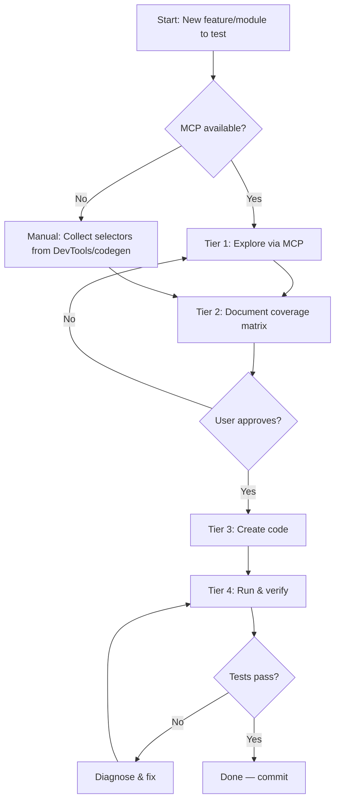
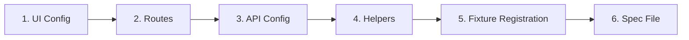

# Test Automation Framework — Workflow

> End-to-end process: from MCP browser exploration to passing tests.

---

## Overview



---

## Prerequisites

| Requirement                  | How to verify                                                                            |
| ---------------------------- | ---------------------------------------------------------------------------------------- |
| Node.js + npm installed      | `node -v && npm -v`                                                                      |
| Dependencies installed       | `npm install`                                                                            |
| `.env` file configured       | Copy from `playwright/environments/.env.*.example`                                       |
| MCP server running           | VS Code → `Ctrl+Shift+P` → "MCP: List Servers" → `playwright` is green                   |
| Auth setup exists for module | Check `playwright/tests/[module].setup.ts` and confirm `playwright.config.ts` matches it |

---

## Path Selection (Iterative)

Choose the path first, then execute tiers.

| Situation                            | Best path         | Why                                            |
| ------------------------------------ | ----------------- | ---------------------------------------------- |
| Unknown feature / unclear selectors  | MCP               | Best discovery quality for dynamic UI states   |
| Known flow + codegen notes available | Playwright CLI    | More token-efficient than full MCP exploration |
| Small edits with known selectors     | No-browser prompt | Fastest route with minimal context overhead    |

If the first path lacks enough confidence, escalate one level:

1. No-browser → Playwright CLI
2. Playwright CLI → MCP

---

## Tier 1 — Explore

**Goal:** Capture the live app's DOM contract, selectors, routes, and behavior.

### Steps

1. **Navigate** to the target page via MCP:

   ```
   browser_navigate → [starting URL]
   ```

2. **Login** if needed (MCP uses its own browser session — `storageState` does NOT apply):

   ```
   browser_type → username field
   browser_type → password field
   browser_click → login button
   ```

3. **Snapshot each page state** — extract:
   - All `[data-test]` / `[data-testid]` attributes
   - Form fields (names, labels, placeholders)
   - Buttons and their visible text
   - Current URL path

4. **Interact with elements** — after each action, capture:
   - URL changes
   - New `data-test` IDs that appeared
   - Calculations or summary values displayed
   - Network requests triggered

5. **Trigger negative paths:**
   - Submit empty forms → capture validation error selectors
   - Invalid inputs → capture error messages
   - Boundary values → capture overflow/truncation

6. **Record all findings** in a structured format.

### MCP Tools Used

| Action                  | Tool                                      |
| ----------------------- | ----------------------------------------- |
| Navigate to URL         | `mcp_playwright_browser_navigate`         |
| See page structure      | `mcp_playwright_browser_snapshot`         |
| Extract data-test attrs | `mcp_playwright_browser_evaluate`         |
| Click elements          | `mcp_playwright_browser_click`            |
| Type into fields        | `mcp_playwright_browser_type`             |
| Check network calls     | `mcp_playwright_browser_network_requests` |
| Visual check            | `mcp_playwright_browser_take_screenshot`  |

### Output

A raw findings list:

- Selector inventory (element → `data-test` value)
- Routes discovered (page → URL path)
- Error messages observed (scenario → text)
- State transitions (before → after)

### Gate

⛔ **STOP.** Present findings to the team/user. Proceed only after approval.

---

## Tier 2 — Document

**Goal:** Produce a reviewable test plan before any code is written.

### Deliverables

#### A. Selector Inventory

| Page/Section | Element  | Attribute | Value       | Already in config? |
| ------------ | -------- | --------- | ----------- | ------------------ |
| Login        | Username | data-test | `user-name` | ✅ / ❌            |

#### B. Route Map

| Page      | URL Path     | Already in `routes.ts`? |
| --------- | ------------ | ----------------------- |
| Dashboard | `/dashboard` | ✅ / ❌                 |

#### C. API Endpoints (if any)

| Endpoint | Method | Triggered By | Expected Status |
| -------- | ------ | ------------ | --------------- |

#### D. Test Coverage Matrix

| Test Case | Type (@smoke/@e2e) | Steps | Key Assertions |
| --------- | ------------------ | ----- | -------------- |

#### E. Business Logic / Calculations

| Calculation | Formula | Example |
| ----------- | ------- | ------- |

#### F. State Transitions

| Element | Before Action | After Action |
| ------- | ------------- | ------------ |

### Diff Against Existing Code

Before approving, check what already exists:

```
playwright/configs/ui/modules/[module]/[module].ui.ts    ← existing selectors
playwright/configs/app/routes.ts                         ← existing routes
playwright/support/helpers/modules/[module].helpers.ts   ← existing methods
playwright/tests/[module]/                               ← existing specs
```

Only new/missing items proceed to Tier 3.

### Gate

⛔ **STOP.** User reviews the coverage matrix. Adjusts scope if needed. Proceed only after approval.

---

## Tier 3 — Create Code

**Goal:** Generate framework-compliant code in strict order.

### Pre-flight Checks

1. **Read adherence files** — all existing configs, helpers, shared utilities
2. **Run duplication detection** — only `NEW_FILE_JUSTIFIED` or `EXTEND_EXISTING` proceeds
3. **Identify what's truly new** — diff discoveries against existing code

### Creation Order (Non-negotiable)



#### Step 1 — UI Config

File: `playwright/configs/ui/modules/[module]/[module].ui.ts`

```typescript
export const MODULE_UI = {
  SECTION: {
    ELEMENT: "data-test-value",
  },
} as const;
```

Rules:

- Add ONLY new selectors not already present
- Group by page section
- Values = raw `data-test` attribute strings
- Dynamic selectors as functions

#### Step 2 — Routes

File: `playwright/configs/app/routes.ts`

```typescript
const MODULE = {
  ROOT: "/path",
  DETAIL: (id: string) => `/path/${id}`,
} as const;
```

Rules:

- Add ONLY new routes not already present
- Use template literal functions for parameterized routes

#### Step 3 — API Config (if endpoints discovered)

File: `playwright/configs/api/modules/[module]/[module].api.ts`

```typescript
import { createModuleConfig } from "@core/api";

export const MODULE_CONFIG = createModuleConfig({
  basePath: "/api/v1",
  prefix: "module",
  resources: { items: ["LIST", "CREATE"] },
});
```

#### Step 4 — Helpers

File: `playwright/support/helpers/modules/[module].helpers.ts`

```typescript
import { Page, expect } from "@playwright/test";
import { MODULE_UI } from "@configs/ui/modules/[module]/[module].ui";
import { ROUTES } from "@configs/app/routes";

export class ModuleHelpers {
  constructor(private page: Page) {}

  async visitList(): Promise<void> {
    /* ... */
  }
  async assertLoaded(): Promise<void> {
    /* ... */
  }
}
```

Rules:

- Method naming: `visit[Page]()`, `assert[State]()`, `[verb][Noun]()`
- Locator priority: `getByRole()` → `getByLabel()` → `getByText()` → `getByTestId()`
- Use `filter({ hasText })` before `.first()` / `.nth()`
- NO `page.waitForTimeout()` — use `expect()` or `waitForResponse()`
- Set up `waitForResponse()` BEFORE the triggering action

#### Step 5 — Fixture Registration

File: `playwright/fixtures/base.fixture.ts`

```typescript
import { ModuleHelpers } from "../support/helpers/modules/module.helpers";

// Add to CustomFixtures type + test.extend()
moduleHelpers: async ({ page }, use) => {
  await use(new ModuleHelpers(page));
},
```

#### Step 6 — Spec File

File: `playwright/tests/[module]/e2e/[module]-[feature].spec.ts`

```typescript
import { test, expect } from "../../../fixtures/base.fixture";
import { MODULE_UI } from "@configs/ui/modules/[module]/[module].ui";
import { ROUTES } from "@configs/app/routes";

test.describe("Module — Feature", { tag: ["@module", "@feature"] }, () => {
  test.beforeEach(async ({ moduleHelpers }) => {
    await moduleHelpers.visitList();
  });

  test("does the thing", { tag: ["@smoke"] }, async ({ moduleHelpers }) => {
    await moduleHelpers.doAction();
    await moduleHelpers.assertResult();
  });
});
```

Rules:

- Import `test`/`expect` from `base.fixture.ts` (NEVER `@playwright/test`)
- Destructure helpers from fixtures
- Each test = 2–5 helper calls (thin orchestration)
- Tag with `@module` + `@smoke`/`@e2e`

---

## Tier 4 — Run & Verify

### Execute

```bash
npx playwright test playwright/tests/[module]/e2e/[module]-[feature].spec.ts \
  --project=[project] --reporter=list
```

### If Tests Fail

1. **Read the error** — identify which locator/assertion failed
2. **Check the MCP exploration data** — was the selector correct?
3. **Common fixes:**

| Failure                                                | Cause                            | Fix                                                      |
| ------------------------------------------------------ | -------------------------------- | -------------------------------------------------------- |
| `locator.click: Timeout` + "intercepts pointer events" | Parent element covers the target | Use `getByRole("button", { name })` on the parent        |
| `expect(locator).toBeVisible: Timeout`                 | Element not rendered yet         | Add preceding assertion or use `waitForResponse()`       |
| `expect(page).toHaveURL: Timeout`                      | Navigation didn't complete       | Verify the triggering action actually navigates          |
| `strict mode violation`                                | Multiple elements match          | Narrow with `.filter({ hasText })` or `.filter({ has })` |

4. **NEVER** add `page.waitForTimeout()` as a fix — find the deterministic condition

### Failure Evidence

The base fixture automatically attaches a small failure-evidence bundle when a test fails:

- console messages
- page errors
- failed requests
- current URL and test metadata

This keeps debugging useful for new contributors without requiring per-test boilerplate.

### Final Validation

Run the full module suite to ensure no regressions:

```bash
npx playwright test --project=[project] --reporter=list
```

---

## Quick Reference — Non-Negotiable Rules

```
NEVER  hardcode selectors          → use config constants
NEVER  hardcode URLs               → use ROUTES
NEVER  page.waitForTimeout(ms)     → use waitForResponse() or expect()
NEVER  import @playwright/test     → use base.fixture.ts (in spec files)
NEVER  login in beforeEach         → use storageState
NEVER  duplicate helpers           → check existing first
NEVER  skip Tier 2                 → user must approve before code

ALWAYS read existing files before writing new code
ALWAYS use storageState for auth
ALWAYS set up waitForResponse() BEFORE the action
ALWAYS run duplication detection before creating files
ALWAYS tag tests (@module + @smoke/@e2e)
ALWAYS validate calculations where applicable
```

---

## File Map — Where Everything Lives

```
playwright/
├── configs/
│   ├── app/routes.ts                              ← Step 2: All URLs
│   ├── api/modules/[module]/[module].api.ts       ← Step 3: API definitions
│   └── ui/modules/[module]/[module].ui.ts         ← Step 1: All selectors
├── support/helpers/
│   ├── common/                                    ← Shared (api, nav, ui)
│   └── modules/[module].helpers.ts                ← Step 4: Module helpers
├── fixtures/base.fixture.ts                       ← Step 5: Registration
└── tests/
    ├── [module].setup.ts                          ← Auth setup
    └── [module]/
        ├── smoke/[module]-smoke.spec.ts           ← Step 6: Smoke tests
        └── e2e/[module]-[feature].spec.ts         ← Step 6: E2E tests
```

---

## npm Commands

| Action              | Command                                                   |
| ------------------- | --------------------------------------------------------- |
| Run all tests       | `npm test`                                                |
| Run smoke only      | `npm run test:smoke`                                      |
| Run specific module | `npx playwright test --project=[project]`                 |
| Run specific spec   | `npx playwright test path/to/spec.ts --project=[project]` |
| Run by tag          | `npx playwright test --grep @tagname`                     |
| Debug mode          | `npm run test:debug`                                      |
| UI mode             | `npm run test:ui`                                         |
| View report         | `npm run report`                                          |
